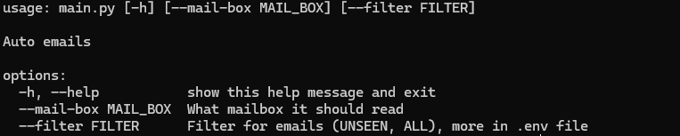
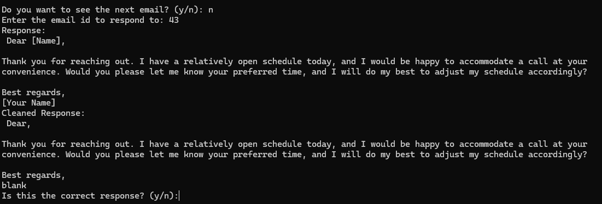

# small_email_client

## Description

This is a small email client that can send emails to a single recipient. It is written in Python and uses the smtplib library to send emails.

## Requirements

python >= 3.9

To run the project, you need to have Python installed on your machine. You can download Python from the [official website](https://www.python.org/downloads/)

**Setting Up the Environment**

* Windows: `./setup_Windows.bat`
* Linux/macOS: `./setup_Linux.sh`

These scripts will install required dependencies, and build a virtual environment for you if you don't have one.

## Usage

```bash
cd bin
python ./main.py
```

Here is a list of commands you can use:


Here is an example of the auto-response you will get when you send an email:


## License

This project is licensed under the MIT License - see the [LICENSE](LICENSE) file for details.

## Author

[Neetre](https://github.com/Neetre)
